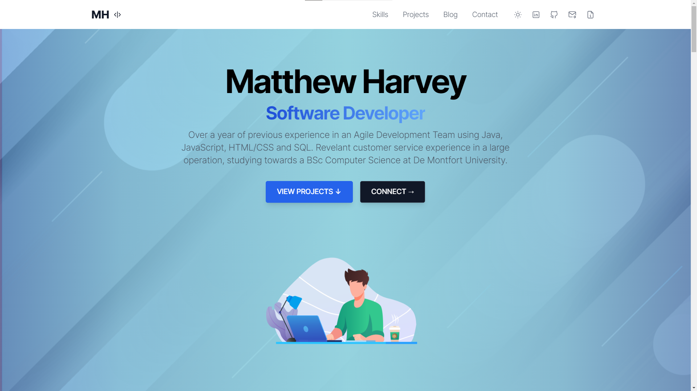

# 🌟 Portfolio - Matthew Harvey

**My Portfolio** is made to highlight my best project work, using both **Astro + Tailwind CSS** to make it shine. 

My socials:

<br>

<a href="https://www.linkedin.com/in/mtlh/" target="_blank"></a>
<a href="https://mtlh.vercel.app" target="_blank"></a> 

<br>

## Demo

📌 [https://mtlh.vercel.app/](https://mtlh.vercel.app/)

<br>



<br>

## Structure

- ✅ Hero
- ✅ Skills
- ✅ Employment/Education
- ✅ Featured Projects
- ✅ CTA
- ✅ Extras
- ✅ Contact

<br>

### Commands

All commands are run from the root of the project, from a terminal:

| Command               | Action                                             |
| :-------------------- | :------------------------------------------------- |
| `npm install`         | Installs dependencies                              |
| `npm run dev`         | Starts local dev server at `localhost:3000`        |
| `npm run build`       | Build your production site to `./dist/`            |
| `npm run preview`     | Preview your build locally, before deploying       |
| `npm run format`      | Format codes with Prettier                         |
| `npm run lint:eslint` | Run Eslint                                         |
| `npm run astro ...`   | Run CLI commands like `astro add`, `astro preview` |

<br>

### Deploy

#### Deploy to production (manual)

You can create an optimized production build with:

```shell
npm run build
```

Now, your website is ready to be deployed. All generated files are located at
`dist` folder, which you can deploy the folder to any hosting service you
prefer.

#### Deploy to Netlify

Clone this repository on your own GitHub account and deploy to Netlify:

[](https://app.netlify.com/start/deploy?repository=https://github.com/mtlh/Portfolio)

#### Deploy to Vercel

Clone this repository on your own GitHub account and deploy to Vercel:

[](https://vercel.com/new/clone?repository-url=https%3A%2F%2Fgithub.com%2Fmtlh%2FPortfolio)

<br>

## Contributing

If you have any idea, suggestions or find any bugs, feel free to open a discussion, an issue or create a pull request.
That would be very useful and I would be happy to listen and take action.

